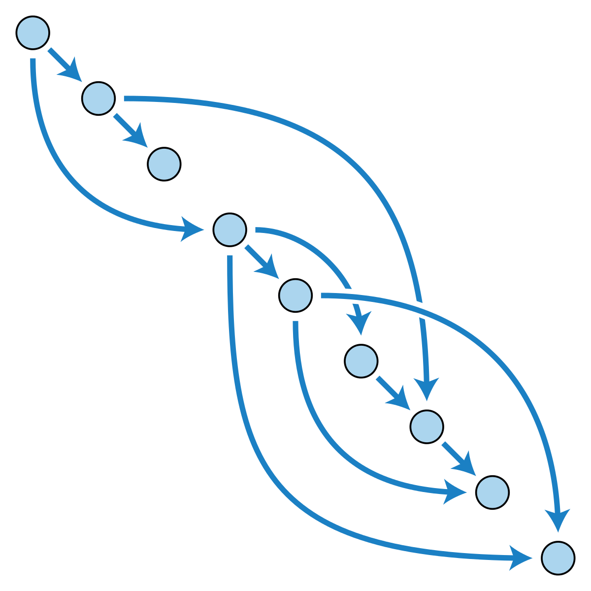

slideNumbers:true
footer:dbdlt03


# Dallas Blockchain & Distributed Ledger Meetup

---

## DAG vs Blockchain

---
[.background-color: #ffffff]


---

##What is a DAG?

---

> "dots with lines pointing to other dots"
- smartcaveman

---

##Directed Acyclic Graph

---
[.background-color: #ffffff]



---

###A directed acyclic graph is a graph having no graph cycles and edges can only move one direction.

---

###A cycle is a path of edges and vertices wherein a vertex is reachable from itself.

---

###A vertex or node is the fundamental unit of which graphs are formed.


---
[.background-color: #ffffff]


---

[.background-color: #ffffff]


---

##Why use a DAG?

---

- DAGs are useful in detecting deadlocks as they illustrate the dependencies amongst a set of processes and resources.
- Some Programming languages (Dryad) describe systems of values that are related to each other by a DAG. When one value changes, its successors are recalculated.
- Using a DAG we can write algorithms to evaluate the computations in the correct order.
- Once in memory, algorithms can be used to calculate the maximum execution time of the entire set.

---

##What are some use cases for a DAG?

---

- __Scheduling__
  When whats being schedules has ordering constraints.
- __Dataflow programming__
  rules engines, parallel processing
- __Geneology and Version History__
  Git, family trees
- __Data Compression__
  A directed acyclic word graph saves space over traditional trie methods.

---

##Ok, so what Blockchain/DLTs are using a DAG?

---

- Byteball
- Ethereum (What? Ethash PoW System)
- Hashgraph
- IOTA
- IoT Chain
- SPECTRE (Protocol)
  Serialization of PoW Events, Confirming Transactiosn via Recursive Elections.

---

##How do we make one?

---

__A Node (Vertex) in the graph.__

```java
class Node {
  private int v;
  private int weight;
  Node(int _v, int_w) { v = _v; weight = _w; }
  int getV() { return v; }
  int getWeight() { return weight; }
}
```
---

```java
class Graph {
  private int V;  // number of vertices'
  private LinkedList<Node>adj[]; // array containing edges.

  Graph(int v) {
    V = v;
    adj = new LinkedList[V];
    for (int i = 0; i < v ; ++i) {
      adj[i] = new LinkedList<Node>();
    }
  }

  void addEdge(int u, int v, int weight) {
    Node n = new Node(v, weight);
    adj[u].add(node);
  }
}
```

---

#Thanks!